# HalfNutELS — Electronic Leadscrew

An open-source **Electronic Leadscrew (ELS)** controller for a metalworking lathe, running on an
**ESP32-WROOM-32E**, with a 320×240 LVGL TFT interface, a 3×3 keypad and a rotary encoder.

An electronic leadscrew replaces a lathe's mechanical change gears / gearbox. Instead of a train of
gears mechanically coupling the spindle to the leadscrew, an **encoder** on the spindle is read by
the microcontroller, which drives a **stepper motor** on the leadscrew in software-defined ratio to
the spindle. This lets you select any thread pitch or feed rate electronically — for single-point
threading and powered feeding — without swapping gears.

> **Note on the name:** *half-nuts* are the split nut a lathe operator clamps onto the leadscrew to
> engage a threading pass — and the part an electronic leadscrew makes redundant, since the pitch is
> now held in software rather than caught on a thread-dial line. The project was called *TeensyELS*
> until August 2026, after the Teensy it began on; Teensy support was removed well before the rename,
> and naming firmware after its microcontroller was a poor idea in the first place. The upstream
> project it derives from is still called TeensyELS — see [Attribution](#attribution). The KiCad
> projects and the board silkscreen also still carry the old name.

> **Note on the hardware:** the current design is the **LVGL board** in
> [`kicad/LVGL/`](kicad/LVGL/) (silkscreened `TeensyELS v0.6`, pre-rename) — an ESP32-WROOM-32E
> soldered directly to the board, driving a 320×240 SPI TFT through LVGL. It is the only board design
> in the repository — the earlier revisions have been removed.

---

## Contents
- [Features](#features)
- [Hardware / Components](#hardware--components)
- [Enclosure & keycaps](#enclosure--keycaps)
- [Getting boards made (PCB)](#getting-boards-made-pcb)
- [Building & flashing the firmware](#building--flashing-the-firmware)
- [Connecting & configuring](#connecting--configuring)
- [Operating the ELS — controls & display](#operating-the-els--controls--display)
- [Cutting a thread](#cutting-a-thread)
- [Firmware updates](#firmware-updates)
- [Settings reference](#settings-reference)
- [Diagnostics](#diagnostics)
- [Testing / development](#testing--development)
- [License](#license)
- [Attribution](#attribution)
- [Safety disclaimer](#safety-disclaimer)

---

## Features

- **Threading** — synchronise the leadscrew to the spindle at a selectable thread pitch for
  single-point threading. Metric (mm/rev) and imperial (TPI) thread pitch tables are built in.
- **Reverse threading** — a thread mode that runs the carriage in the opposite direction (from the
  left stop toward the right) for left-hand threads or threading away from a shoulder.
- **Feeding** — powered feed at a selectable feed rate (mm/rev metric, or thou/rev imperial).
- **Feed / thread mode switching** from the panel; **metric / imperial** from the menu.
- **Jog** — move the carriage left/right under power. Supports both an interactive "hold to jog"
  mode and a "jog to stop" mode.
- **End stops / stop positions** — set left and right stop positions so the carriage automatically
  decelerates and stops at a repeatable point (useful for threading up to a shoulder).
- **Thread sync** — the leadscrew tracks the spindle's angular position so a partially cut thread can
  be picked up again on the next pass.
- **Motion lockout** — while the carriage is under power the panel answers only **HALT** and
  **ENABLE**. There is no lock key to remember: the machine locks itself exactly when it matters.
  (This replaced an explicit button lock, which had to be unlocked at every power-on.)
- **DRO** — carriage position referenced to an endstop, with a travel bar that doubles as a readout.
- **Dark and light themes**, selectable on the device.
- **Web-based configuration** — all lathe parameters (encoder PPR, stepper PPR, gearbox ratio,
  leadscrew pitch, speeds, acceleration) plus WiFi credentials are configured over a built-in web
  page; settings are stored in the ESP32's non-volatile flash.
- **Over-the-air (OTA) firmware update** — pulls the latest [GitHub release](https://github.com/martinlong1978/HalfNutELS/releases)
  from a stable permalink and skips the download if the device is already on that version.
- **Motion-trace capture** — records ~25 s of following error, loop timing and spindle deltas and
  uploads it as CSV for offline analysis. Built to diagnose a threading glitch; kept because it is
  the fastest way to answer "is the fault in the maths or in the timing?".
- **On-device display** — a 240×320 ST7789 SPI TFT, driven in landscape (**320×240**) via **LVGL**,
  shows current mode, pitch, spindle RPM and status.
- **Rotary encoder** — turns to adjust whatever the panel currently has focused; its
  built-in LED shows the run state at a glance (the firmware drives the red and green channels,
  alternating them to flash a two-colour status).

---

## Hardware / Components

The controller is built around a custom PCB. KiCad design files, gerbers and fabrication outputs are
in the [`kicad/`](kicad/) directory.

**The current design is [`kicad/LVGL/`](kicad/LVGL/)** — silkscreened *TeensyELS v0.6*, a **4-layer**
board of roughly **113 × 109 mm**. It does not socket a dev-board module: the **ESP32-WROOM-32E is
soldered directly to the PCB**, the display is a separate SPI TFT module on a 14-pin socket, and the
board is designed to be **SMT-assembled** (JLCPCB) with only the connectors and the rotary encoder
hand-soldered.

### Bill of materials

**SMT parts** — taken from the JLCPCB production BOM
([`kicad/LVGL/jlcpcb/production_files/BOM-TeensyELS.csv`](kicad/LVGL/jlcpcb/production_files/BOM-TeensyELS.csv)),
cross-checked against the schematic:

| Designator(s) | Qty | Part / Value | Footprint | LCSC |
|---|---|---|---|---|
| U2 | 1 | **ESP32-WROOM-32E** — main controller (Wi-Fi module, 4 MB flash) | ESP32-WROOM-32D | C701342 |
| U1 | 1 | AMS1117-3.3 — 5 V → 3.3 V regulator | SOT-223-3 | C6186 |
| Q2–Q7, Q9 | 7 | BSS138 N-channel MOSFET (3.3 V ↔ 5 V level shifting, LED drive) | SOT-23 | C7420339 |
| C1 | 1 | 10 µF capacitor | 0805 | C15850 |
| C2 | 1 | 22 µF capacitor | 0805 | C45783 |
| C3, C4 | 2 | 0.1 µF capacitor | 0805 | C49678 |
| R1–R8, R11, R12, R18, R20, R21 | 13 | 10 kΩ resistor (pull-ups) | 0805 | C17414 |
| R9, R10, R19 | 3 | 330 Ω resistor (encoder LED series) | 0805 | C17630 |
| R13, R14 | 2 | 0 Ω link (encoder direct-connect option) | 0805 | C17477 |
| R17 | 1 | 1 kΩ resistor | 0805 | C17513 |
| SW1–SW10 | 10 | Omron B3FS-101xP **SMD** tactile switch (SW2–SW10 = the 3×3 keypad; SW1 = stepper-enable override) | SW_SPST_Omron_B3FS-101xP | C231324 |
| J5 | 1 | 2×3 1.27 mm header — UART programming header | PinHeader 2x03 1.27 mm SMD | C42372553 |

**Not fitted (DNP)** — an alternative encoder input path, see the note below:

| Designator(s) | Qty | Part / Value |
|---|---|---|
| Q1, Q8 | 2 | BSS138 (encoder level-shift MOSFETs) |
| R15, R16 | 2 | 1 kΩ (gate resistors for Q1/Q8) |

**Through-hole / hand-soldered parts** — these are *not* in the assembly BOM and must be fitted
yourself:

| Designator | Qty | Part | Purpose |
|---|---|---|---|
| J1 | 1 | Shielded RJ45 jack (RCH RC01937) | **Stepper driver** — step / dir / enable / alarm, at 5 V |
| J2 | 1 | JST-XH 4-pin vertical header (B4B-XH-A) | **Spindle encoder** — 5 V, GND, A, B |
| J3 | 1 | 1×14 2.54 mm socket | **Display module** (see below) |
| J4 | 1 | 2-pin 5.08 mm screw terminal (CUI TB007-508-02) | **5 V power input** |
| E1 | 1 | Illuminated (RGB) rotary encoder, SparkFun footprint | Pitch / jog-rate selection + status LED |

Not on the board at all, but **required to build a working ELS**:

- A **240×320 SPI TFT module** with the common **14-pin 2.54 mm header** (9 display pins + 5 touch
  pins). The firmware drives it as an **ST7789** and uses it in landscape, 320×240. Only the display
  pins are wired — the 5 touch pins are unconnected, and the backlight pin is tied to +3.3 V, so the
  backlight is permanently on and is *not* under software control.
- A **spindle encoder** — a quadrature encoder on the lathe spindle, wired to **J2** (not J1). The
  default configuration assumes **1200 PPR** (see [Settings reference](#settings-reference)).
- A **stepper motor + driver** for the leadscrew, wired to the RJ45 jack **J1**. The board provides
  step, dir and enable as 5 V open-drain outputs (10 kΩ pull-ups to +5 V) and accepts the driver's
  alarm output. The default configuration assumes a **400 step/rev** stepper.
- A **5 V supply** into J4 (which also feeds the encoder and the 3.3 V regulator), plus a suitable
  **power supply for the stepper driver** itself.
- A **USB-to-serial adapter** for flashing — the board has no USB connector, see
  [Building & flashing](#building--flashing-the-firmware).

> **Encoder input — 3.3 V vs 5 V.** J2's A/B pins can reach the ESP32 two ways: directly through the
> 0 Ω links **R13/R14**, or level-shifted through **Q1/Q8 + R15/R16**. The assembly BOM fits the 0 Ω
> links and leaves the MOSFET path off, i.e. it expects an encoder whose outputs are safe to feed
> straight into a 3.3 V GPIO. If your encoder swings to 5 V, fit Q1/Q8 and R15/R16 and leave R13/R14
> off. **Please verify against the schematic** ([`kicad/LVGL/TeensyELS.kicad_sch`](kicad/LVGL/TeensyELS.kicad_sch))
> before ordering.

### Connectors

| Ref | Type | Pinout |
|---|---|---|
| **J4** | 2-pin screw terminal | 1 = GND, 2 = **+5 V in** |
| **J2** | JST-XH 4-pin | 1 = +5 V, 2 = GND, 3 = encoder B, 4 = encoder A |
| **J1** | RJ45 (shielded) | 1 = ALARM (in), 3 = ENABLE, 5 = DIR, 7 = STEP; 2/4/6/8 = GND; shield = GND. All 5 V. |
| **J3** | 1×14 socket (display) | 14 = VCC, 13 = GND, 12 = CS, 11 = RESET, 10 = DC, 9 = MOSI, 8 = SCK, 7 = LED (tied to +3.3 V), 6 = MISO (not connected to the ESP32); 5–1 = touch pins, unconnected |
| **J5** | 2×3 1.27 mm | 1 = EN, 2 = +3.3 V, 3 = TXD, 4 = GND, 5 = RXD, 6 = BOOT (GPIO0) |
| **SW1** | on-board push button | Pulls the stepper **ENABLE** line to +5 V — a manual override, independent of the firmware |

### Pin assignments (ESP32)

Defined in [`lib/config/board.h`](lib/config/board.h) and matching the LVGL schematic:

| Function | GPIO |
|---|---|
| Spindle encoder A / B (J2) | 35 / 34 |
| UI rotary encoder A / B (E1) | 39 / 36 |
| Encoder status LED — red / green / blue (E1) | 22 / 21 / 12 |
| Leadscrew step | 25 |
| Leadscrew direction | 26 |
| Stepper enable | 17 |
| Stepper driver alarm input | 27 *(wired on the board; not read by the current firmware)* |
| Keypad matrix rows (H1/H2/H3) | 32 / 33 / 2 |
| Keypad matrix columns (V1/V2/V3) | 13 / 14 / 15 |
| TFT display (MOSI/SCLK/CS/DC/RST) | 19 / 18 / 5 / 16 / 23 |
| TFT backlight (`TFT_BL`) | 4 *(defined in the build flags but **not connected** on this board)* |
| Programming UART TXD / RXD (J5) | 1 / 3 |

> The A/B pins of both encoders are swapped in `board.h` relative to the schematic net names — that
> only sets which way round the counting goes, and is deliberate.

> **The keypad matrix is polled, not interrupt-driven.** A 2 ms task scans it and a host-tested
> debounce ([`lib/keyscan/`](lib/keyscan/)) turns the readings into press / click / hold / release
> events. Edge interrupts were tried and removed — see [`docs/keypad-audit.md`](docs/keypad-audit.md)
> for why they cannot be made reliable here.

---

## Enclosure & keycaps

Two 3D models are provided in [`cad/`](cad/), both as **STEP** files:

| File | What it is |
|---|---|
| [`cad/Keycaps.step`](cad/Keycaps.step) | Keycaps for the 3×3 keypad |
| [`cad/Enclosure.step`](cad/Enclosure.step) | A full enclosure for the controller |

STEP is a neutral CAD interchange format — it imports into FreeCAD, Fusion and SolidWorks, so the
models can be measured and edited before you make anything from them. To 3D-print a part, convert it
to **STL** or **3MF** in your CAD tool and slice that; the same STEP file can go to a machine shop if
you would rather have the enclosure cut than printed.

The keycaps cover the nine keys of the panel keypad — which legend belongs on which cap is set out in
[Keypad layout](#keypad-layout), along with the warning to re-confirm the scan codes before making
caps if you have rewired the loom. For reference when checking fit, the board itself is roughly
**113 × 109 mm**.

> No print settings, material or fastener sizes are specified with these models. Check them against
> your own printer and hardware before committing to a run.

---

## Getting boards made (PCB)

Fabrication outputs for the LVGL board are pre-generated under [`kicad/LVGL/`](kicad/LVGL/). The
JLCPCB set in [`kicad/LVGL/jlcpcb/production_files/`](kicad/LVGL/jlcpcb/production_files/) is the one
to use — it is the only output that carries **LCSC part numbers**, and its BOM matches the assembly
intent (SMT parts only, encoder level-shift path left off).

> ⚠️ **Do not use `kicad/LVGL/production/bom.csv` or `positions.csv`.** Those files are stale
> carry-overs from an earlier board revision — they still list a socketed display module and a Teensy
> footprint, neither of which exists on this board. Regenerate them from KiCad if you need them.

### Option A — JLCPCB (bare board, or with assembly)

1. Go to [jlcpcb.com](https://jlcpcb.com) and click **Add gerber file**.
2. Upload [`kicad/LVGL/jlcpcb/production_files/GERBER-TeensyELS.zip`](kicad/LVGL/jlcpcb/production_files/GERBER-TeensyELS.zip)
   (do **not** unzip it — upload the zip directly). The KiCad-native export
   [`kicad/LVGL/gerbers.zip`](kicad/LVGL/gerbers.zip) is equivalent if you prefer it.
3. Confirm the auto-detected settings: **Layers = 4**, and the board dimensions shown in the preview
   (≈113 × 109 mm). Choose thickness, colour, surface finish, etc. as desired.
4. *(Optional — assembly / PCBA)* Enable **PCB Assembly** (top side only), then upload:
   - **BOM:** [`kicad/LVGL/jlcpcb/production_files/BOM-TeensyELS.csv`](kicad/LVGL/jlcpcb/production_files/BOM-TeensyELS.csv)
   - **Pick-and-place / CPL:** [`kicad/LVGL/jlcpcb/production_files/CPL-TeensyELS.csv`](kicad/LVGL/jlcpcb/production_files/CPL-TeensyELS.csv)
5. Review the placement in JLCPCB's assembly preview — pay particular attention to the orientation of
   U1, U2 and the MOSFETs — resolve any part substitutions, and place the order.
6. Hand-solder the through-hole parts afterwards: **J1, J2, J3, J4 and the rotary encoder E1**.

### Option B — PCBWay

1. Go to [pcbway.com](https://www.pcbway.com) and choose **Quick-order PCB → Add Gerber File**.
2. Upload [`kicad/LVGL/gerbers.zip`](kicad/LVGL/gerbers.zip).
3. Confirm layer count (**4**) and dimensions, pick your board options, and add to cart.
4. *(Optional — assembly)* Choose **Turnkey Assembly** and provide the BOM and pick-and-place files
   above. PCBWay does not use LCSC numbers directly, so expect to confirm equivalents for each line.

---

## Building & flashing the firmware

The firmware is a [PlatformIO](https://platformio.org/) project (see
[`platformio.ini`](platformio.ini)).

### 1. Install PlatformIO

Install the [PlatformIO IDE extension for VS Code](https://platformio.org/install/ide?install=vscode),
or the [PlatformIO Core CLI](https://docs.platformio.org/en/latest/core/installation/index.html).
PlatformIO will automatically download the ESP32 toolchain and the libraries listed in
`platformio.ini` on first build.

### 2. Connect a USB-to-serial adapter

The LVGL board has **no USB connector** — the ESP32-WROOM-32E is programmed through the 2×3 1.27 mm
header **J5**:

| J5 pin | Signal | Adapter |
|---|---|---|
| 1 | EN (reset) | RTS *(optional — for auto-reset)* |
| 2 | +3.3 V | — *(do not back-feed if the board is powered from J4)* |
| 3 | TXD (ESP32 → adapter) | RX |
| 4 | GND | GND |
| 5 | RXD (adapter → ESP32) | TX |
| 6 | BOOT (GPIO0) | DTR *(optional — for auto-bootloader)* |

Use a **3.3 V** adapter. If you only wire TX/RX/GND, you must put the module into the bootloader by
hand — hold GPIO0 low, pulse EN low and release it, then start the upload.

### 3. Build & upload

There are two ESP32 build environments:

- **`esp32dev_usb`** — build and flash over the serial adapter. This is the environment to use for
  normal development. Edit the `upload_port` in `platformio.ini` (default `COM14`) to match the port
  your adapter enumerates as.

  ```sh
  pio run -e esp32dev_usb -t upload
  ```

- **`esp32dev_publish`** — a release build that uses a custom upload command (`publish.cmd`) for
  producing/publishing an OTA image rather than a direct flash.

  ```sh
  pio run -e esp32dev_publish
  ```

Both ESP32 environments still declare `board = lilygo-t-display`. That is just a convenient 4 MB
ESP32-D0WD profile and is compatible with the WROOM-32E module — the display geometry that matters is
set explicitly in the build flags (`TFT_WIDTH=240`, `TFT_HEIGHT=320`, ST7789 driver, SPI pins), and a
custom 4 MB partition table (`my_4MB.csv`) is used.

---

## Connecting & configuring

Configuration is done over WiFi through a built-in web page — there is no need to recompile to
retune the firmware for your lathe.

1. **Enter configuration mode.** The device starts a WiFi **Access Point** on first boot (when no
   valid settings are stored yet), whenever you **hold `OK` — the centre key — while powering on**,
   or from the **Wi-Fi setup** menu tile. See [`src/main.cpp`](src/main.cpp).
   - AP SSID: **`ELS_Wifi`**
   - AP password: **`123456789`**
2. **Connect** your phone or laptop to that access point. The SSID, password and IP address are shown
   on the device's display, along with a QR code for the WiFi credentials.
3. **Open the device in a browser.** The firmware runs a **captive portal** — a catch-all DNS server
   plus the usual Android/Apple/Windows detection URLs — so most phones will pop the configuration
   page up automatically on connecting. If yours doesn't, browse to the IP shown on the display
   (typically `192.168.4.1`) to reach the *ELS Setup* page.

| First-run setup screen | Connected |
|---|---|
|  | 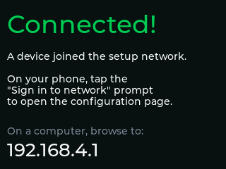 |

4. **Fill in the settings** (see [Settings reference](#settings-reference)) and press **Submit**.
   Settings are written to the ESP32's flash. Press **Reset** on the page (or power-cycle) to reboot
   into normal operation with the new settings.

---

## Operating the ELS — controls & display

The panel is nine keys and a rotary encoder. Everything below is driven from those.

> Every screenshot in this README is rendered from the **real display code** on a host machine
> (`bash tools/screenshot/render.sh`), so what you see here is what the panel draws.

### Power-on

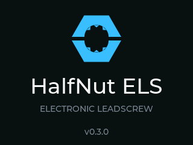

The splash holds for **two seconds** on every normal boot, then the rest screen replaces it. It
carries the running **firmware version**, which is the quickest way to check what a machine is on
without opening the menu — worth a glance after an over-the-air update. It is drawn on whichever
theme is stored, and it is skipped entirely on the first-run setup path, where the Wi-Fi credentials
matter more than the branding.

### The rest screen

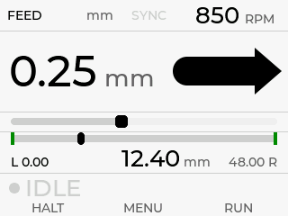

Top row: **mode**, **units**, **sync state**, **spindle RPM**. The large figure is the current pitch
or feed rate. Below it the **travel bar** shows the carriage between the endstops — it doubles as a
DRO readout. The chip at the bottom left is the **machine state** (`IDLE`, `FEED`, `THREAD`, `JOG`).

| Metric thread | Imperial feed | Spindle running backwards |
|---|---|---|
| 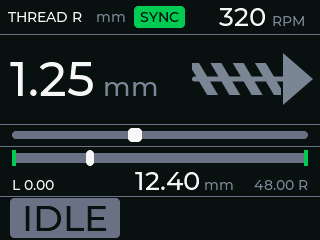 | 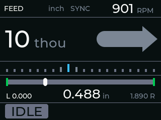 | 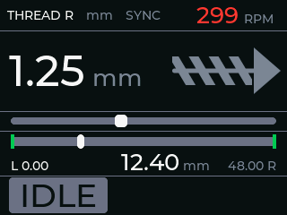 |

### Keypad layout

Selectors along the top, the two actuators plus `OK` in the middle where your thumbs sit, and
machine state along the bottom:

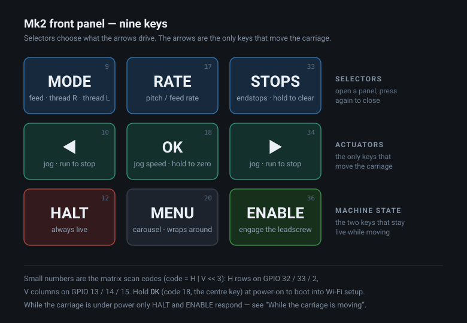

| | Left | Centre | Right |
|---|---|---|---|
| **Top row** | `MODE` | `RATE` | `STOPS` |
| **Middle row** | `◀` | `OK` | `▶` |
| **Bottom row** | `HALT` | `MENU` | `ENABLE` |

The small numbers on the diagram are the **matrix scan codes** — useful when wiring a panel or
reading a debug trace. They are `code = H | V << 3`, with the H rows on GPIO 32 / 33 / 2 and the V
columns on GPIO 13 / 14 / 15; the mapping is defined in [`lib/config/board.h`](lib/config/board.h).
If you rewire the loom the nine codes stay distinct but the assignment transposes, so re-confirm by
pressing each key and reading its code before making new caps.

The three top keys choose **what the arrows drive**; the arrows are the only actuators. That is the
*focus model*: press a selector, a panel opens, the arrows adjust it, `OK` commits. Focus returns to
jog on its own after 4 seconds.

*(Holding `OK` during power-on boots into Wi-Fi configuration mode.)*

### Arrows at rest — jog

With nothing else focused the arrows move the carriage, and what they do depends on whether that
side has a stop set — the machine already knows which behaviour you mean:

| | Stop **set** on that side | Stop **unset** |
|---|---|---|
| **Click** | Run under power to the stop, then hold | — |
| **Hold** | (same as click) | Jog continuously while held; decelerate on release |

A second press of the same arrow during a powered run **cancels** it.

### Key reference

| Control | Click | Hold |
|---|---|---|
| `MODE` | Open the mode picker — Feed / Thread R / Thread L | — |
| `RATE` | Open the pitch picker | — |
| `STOPS` | Open the stops panel | Clear **both** stops, after a 1 s confirm |
| `◀` / `▶` | Jog, or run to the stop (see above) | Continuous jog when no stop is set |
| `OK` | Jog-speed picker (at rest); commit and close (in a picker) | **Zero the DRO** here |
| `MENU` | Open the menu carousel; press again to close | — |
| `HALT` | Decelerate to a stop. **Always live**, from any screen | — |
| `ENABLE` | Engage / disengage the leadscrew | — |
| Encoder | Adjust whatever is focused (pitch at rest) | — |

Pressing the **same selector twice** closes its panel again — `MODE`, `RATE`, `STOPS` and `MENU` all
toggle.

**`ENABLE` takes two presses when a panel is open**: the first dismisses the panel, the second
engages. Engaging is a commitment to cut, and it should not happen while a picker is covering the
state chip.

### The selector panels

| `MODE` | `RATE` | `OK` — jog speed |
|---|---|---|
| 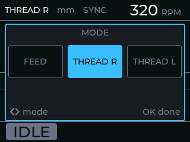 | 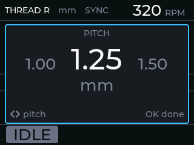 | 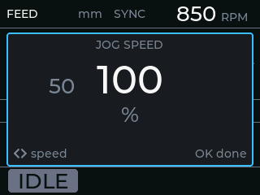 |

**Stops.** The panel shows the travel bar full width with both markers and the live position.
Setting a stop is cheap to undo; clearing one loses a position you may have spent time finding, so
the two gestures are deliberately asymmetric:

| Gesture | Effect |
|---|---|
| `◀` click, left stop unset | Set the left stop **here** |
| `◀` click, left stop set | Prompts "hold to clear" — no action |
| `◀` hold, left stop set | Clear the left stop |
| `STOPS` hold | Clear **both**, after a 1 s confirm bar |

`▶` is the mirror.

| Stops panel | Clearing both — confirm bar filling |
|---|---|
| 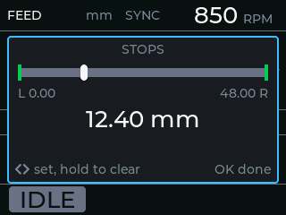 | 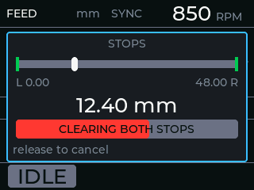 |

### The menu

`MENU` opens a horizontal carousel; the arrows move between tiles and `OK` activates. The carousel
**wraps**, so the far end is one press away in the other direction. Tiles never edit in place — `OK`
either performs a one-shot action or opens the matching panel.

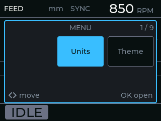

| Tile | `OK` does |
|---|---|
| **Units** | Toggle mm / inch |
| **Theme** | Toggle dark / light (persisted) |
| **DRO datum** | Choose which endstop is zero (persisted) |
| **Jog speed** | Open the jog-speed picker |
| **Sync** | Set a thread sync point at the current spindle angle and carriage position |
| **Software update** | Check for and install a new firmware release |
| **Wi-Fi setup** | Reboot into the configuration access point |
| **Diagnostics** | Live following error, spindle vs leadscrew rates, sync anchor |
| **About** | Firmware version, IP address, uptime |
| **Debug capture** | Arm a motion-trace capture |

A tile that cannot act right now renders as **UNAVAILABLE** with the reason on the hint row, rather
than vanishing — so the tile numbering never shifts under you:

| Sync, outside a thread mode | Update, while the carriage is moving |
|---|---|
| 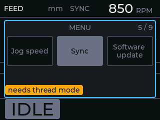 | 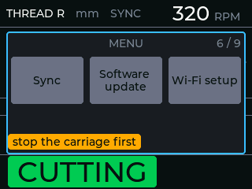 |

### The DRO

A position is meaningless without a zero, and "wherever the machine happened to boot" is the worst
available choice — so **zero is referenced to an endstop**. First match wins:

| # | Condition | Datum |
|---|---|---|
| 1 | Manual zero set (`OK` held) | That position, tagged `MAN` |
| 2 | Both stops set | The one chosen on the **DRO datum** tile |
| 3 | Exactly one stop set | That one — the preference cannot be honoured |
| 4 | Neither stop set | Power-on origin, flagged `REL` |

Position increases to the **right**, so a right-hand datum counts negative leftward — ordinary DRO
behaviour. The readout flashes for about a second whenever the datum moves, because setting a second
stop can hand zero to the other end and the numbers will jump.

| DRO datum picker | Refused while under power |
|---|---|
| 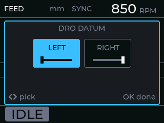 | 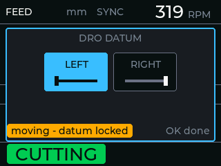 |

### While the carriage is moving

The panel answers **only `HALT` and `ENABLE`**. No menus, no pickers, no settings — and any open
panel closes itself when motion starts. Your attention belongs on the tool and the work, not the
screen. `HALT` is the reflex; `ENABLE` is the deliberate one.

The one exception is **Diagnostics**, which stays up through jogging and cutting because watching it
while the machine runs is the entire point. `OK` clears it.

| Jogging | Cutting | Decelerating |
|---|---|---|
| 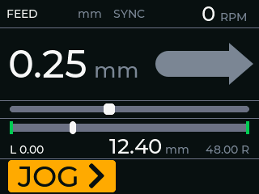 | 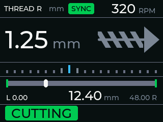 | 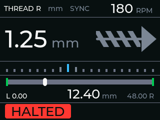 |

---

## Cutting a thread

1. **Set the mode.** `MODE`, arrows to **Thread R** (or **Thread L** for a left-hand thread), `OK`.
2. **Set the pitch.** `RATE`, arrows to your pitch, `OK`. The **Units** tile switches between metric
   and TPI; the controller remembers a pitch per mode-and-unit pair, so switching back and forth
   does not lose your place.
3. **Set the stops.** Jog to where the thread should end — usually just short of the shoulder — press
   `STOPS`, then `◀` or `▶` to set that stop. Do the same at the starting end. The carriage now
   decelerates and stops there on every pass, which is what makes threading to a shoulder
   repeatable.
4. **Return to the start** and take your first depth of cut on the cross-slide.
5. **Press `ENABLE`.** The leadscrew waits for the spindle to come round to the sync point, then
   tracks the thread to the far stop and stops.
6. **Retract, return the carriage, advance the depth, `ENABLE` again.** The sync point is preserved,
   so every pass follows the same helix.

**Picking up an existing thread.** Stop the spindle, hand-position the tool so it sits in an existing
groove, then use the **Sync** menu tile. That declares "this spindle angle and this carriage position
are in sync", and every later engagement re-enters that same helix instead of ploughing a new groove
across it. The **Diagnostics** screen shows which anchor is currently in use.

### Feeding

Same flow, simpler: `MODE` → **Feed**, `RATE` → your feed rate (mm/rev, or thou/rev in imperial), set
a stop if you want the cut to end somewhere repeatable, then `ENABLE`.

---

## Firmware updates

**From the device.** `MENU` → **Software update** → `OK`. The controller checks the latest
[GitHub release](https://github.com/martinlong1978/HalfNutELS/releases), tells you if you are already
on it, and otherwise downloads and flashes, showing progress on screen. It uses the Wi-Fi credentials
from the setup page.

| Checking | Already current | Downloading |
|---|---|---|
|  |  |  |

**Over USB.** `pio run -e esp32dev_usb -t upload`, via the J5 serial header.

**Publishing your own.** Bump `FIRMWARE_VERSION` in [`include/version.h`](include/version.h), then
`pio run -e esp32dev_publish` and `bash scripts/release.sh` (needs the `gh` CLI). The OTA permalink
resolves to whatever is marked *latest*, so publish full releases rather than drafts.

---

## Settings reference

Settings come in two kinds, and the split is deliberate.

**Lathe geometry is web-only.** Encoder PPR, stepper PPR, direction, gearbox ratio, leadscrew pitch,
jog speed, acceleration and max speed are *commissioning* values: set once over Wi-Fi with the lathe
offline, and changed only there. The device never writes them. Getting one wrong turns every
subsequent cut into scrap, so they are deliberately not reachable from a panel you might brush past
mid-job.

**Preferences are on-device.** Theme and DRO datum are the things worth changing mid-session, and
they live on the menu. Saving them is refused while the carriage is under power.

### Wi-Fi / update settings

| Web label | Field | Meaning |
|---|---|---|
| **Wi-Fi network** | `ssid` | Network the device joins for OTA updates and trace uploads. Up to 31 chars. |
| **Wi-Fi password** | `password` | Up to 62 chars. Leave blank for an open network. |
| **Firmware update URL** | `url` | Where **Software update** pulls from. Defaults to this repo's `latest` release permalink. |
| **Debug capture URL** | `debugUrl` | Where the **Debug capture** tile POSTs its motion trace. Blank disables sending. See [`tools/debugsink/`](tools/debugsink/). |

### Lathe geometry

Defaults are in [`lib/config/latheconfig.h`](lib/config/latheconfig.h).

| Web label | Field | Default | Units | Meaning |
|---|---|---|---|---|
| **Spindle encoder** | `spindleEncoderPpr` | `1200` | pulses/rev | Pulses per spindle revolution. Must match your encoder or every pitch is wrong. |
| **Stepper** | `stepperPpr` | `400` | steps/rev | Steps per stepper revolution — full steps × the microstepping set on the driver. |
| **Invert motor direction** | `invertDirection` | `true` | boolean | Flips the direction sense so left and right match your lathe. |
| **Gearbox ratio** | `gearboxRatioNumerator` / `gearboxRatioDenominator` | `2` / `1` | ratio | Any mechanical reduction between stepper and leadscrew. Effective ratio = numerator ÷ denominator. |
| **Leadscrew pitch** | `leadscrewPitchMm` | `2.54` | mm/rev | Carriage travel per leadscrew revolution. |
| **Jog speed** | `jogSpeed` | `40` | mm/s | Full-speed jog. The on-device jog-speed picker selects a percentage of this. |
| **Acceleration** | `leadscrewAcceleration` | `150` | mm/s² | Ramp used for all leadscrew motion. |
| **Max speed** | `leadscrewMaxSpeed` | `40` | mm/s | Upper limit for leadscrew motion. |

Steps/mm, pulses/sec and the pulse timings are derived from these once at startup
([`lib/config/latheconfig.cpp`](lib/config/latheconfig.cpp)); the metric and imperial pitch tables
are in [`lib/config/config.h`](lib/config/config.h).

### On-device preferences

| Setting | Where | Options |
|---|---|---|
| **Units** | `MENU` → Units | mm / inch |
| **Theme** | `MENU` → Theme | Dark / light — persisted |
| **DRO datum** | `MENU` → DRO datum | Which endstop is zero when both are set — persisted |
| **Jog speed** | `OK` at rest, or `MENU` → Jog speed | 1 %, 5 %, 10 %, 25 %, 50 %, 100 % of the configured jog speed |

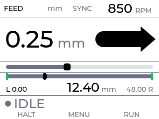

*The light theme. Both are designed for the panel rather than inverted from each other.*

### Where settings live, and how to wipe them

Settings are stored as a raw struct in flash, guarded by a validity sentinel (`CHECKVALUE` in
[`lib/config/latheconfig.h`](lib/config/latheconfig.h)). If the stored value does not match the
firmware's, the whole blob is discarded and the device boots into first-run AP setup — which is how
a firmware change that moves the layout avoids reading someone else's bytes as your geometry.

To clear everything deliberately — including Wi-Fi credentials — use **Factory reset** at the bottom
of the web setup page. It asks for confirmation, then reboots into first-run setup.

---

## Diagnostics

`MENU` → **Diagnostics** shows live following error, spindle and leadscrew rates, and which sync
anchor the helix is currently pinned to. Unlike every other screen it **stays up while the machine
runs**, because that is when its numbers mean anything — at rest they are all zero. `OK` clears it.

| Diagnostics | Following error | Manual sync anchor |
|---|---|---|
| 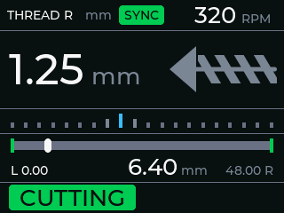 | 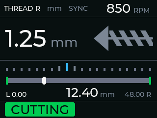 | 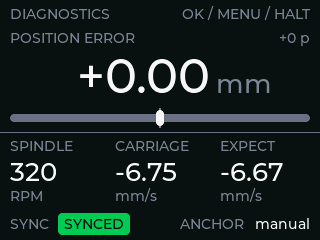 |

**Motion-trace capture.** `MENU` → **Debug capture** arms a recorder that samples following error,
loop timing and spindle deltas at 40 Hz for about 25 seconds, then uploads it as CSV to the
**Debug capture URL** once the carriage is at rest. [`tools/debugsink/`](tools/debugsink/) has a
stdlib-only Python receiver, a PHP drop-in and an analysis script that flags direction reversals and
correlates error spikes against loop stalls — which is what distinguishes "the maths is wrong" from
"the loop is being starved".

---

## Testing / development

The motion/business logic is designed to be unit-testable on your host machine without any hardware,
using the **`native`** PlatformIO environment (the project's default env), which builds against
GoogleTest/GMock:

```sh
pio test -e native
```

The suite is 455 cases and covers the parts where a mistake is expensive: the UI focus state machine,
the keypad debounce and gesture recognition, DRO datum resolution, thread-sync anchoring, stop
handling, the config layout in flash, and the trace capture. Motion tests drive a virtual clock so a
spindle can be turned at a chosen rate without hardware.

### Seeing the screens without a lathe

```sh
bash tools/screenshot/render.sh
```

Renders the **real** `Display` class on the host and writes one 320×240 PNG per scenario to
`tools/screenshot/out/` — every screenshot in this README came from it. Only `Arduino.h`, `SPI.h` and
`TFT_eSPI.h` are shimmed; the display, DRO, UI state and LVGL build are the production code, against
the project's own `lv_conf.h`. Scenes drive it through the same public inputs the firmware does, so a
screen the keypad cannot reach cannot be screenshotted either.

`native` is built with `-D PIO_UNIT_TESTING=1`, which selects host test doubles in place of the
ESP32 hardware classes. See the [`test/`](test/) directory for the test suites.

---

## License

This project is licensed under the **GNU General Public License v3.0**. See the [`LICENSE`](LICENSE)
file for the full text.

You are free to use, study, share and modify this software under the terms of the GPLv3. Derivative
works and distributed modified versions must also be made available under the GPLv3.

---

## Attribution

This firmware is **derived from the "TeensyELS" project by NoEngineerHere** (associated with the
*Not an Engineer* YouTube channel), with thanks to the upstream author for the original work this
builds on:

- **Upstream repository:** https://github.com/NoEngineerHere/TeensyELS

The derivation is evidenced by this repository's original name (*TeensyELS*, matching upstream, until
the August 2026 rename to *HalfNutELS*), the near-verbatim original `README.md` stub, a shared project
structure (PlatformIO project, `native` GoogleTest environment, `kicad/` hardware directory), and this
repo's history migrating from Teensy to ESP32 (Teensy support removed in commit `cbd1b22`).

**Licensing:** the project owner has confirmed that release under the GPLv3 is cleared.

> A separate, well-known project — **Clough42 "electronic-leadscrew"** by James Clough
> (https://github.com/clough42/electronic-leadscrew) — is a *different* ELS design (TI F280049C
> microcontroller, MIT-licensed) and is **not** the upstream of this code; it is noted only to avoid
> confusion with the best-known open ELS project.

---

## Safety disclaimer

**This project controls moving machinery and is provided with no warranty of any kind.**

A lathe with a powered leadscrew can cause **serious injury or death** and can destroy tooling and
workpieces. An electronic leadscrew removes the mechanical safeguards of change gears — a software
bug, miswired encoder, wrong setting, or loss of spindle sync can drive the carriage unexpectedly,
including into the chuck.

- Use at your **own risk**. You are responsible for the safe design, wiring, configuration and
  operation of your machine.
- **Test thoroughly with the spindle stopped and, where possible, the leadscrew disconnected** before
  cutting.
- Always know where your **stop positions** and emergency stop are before engaging.
- This firmware is **experimental** and, as noted above, may contain bugs affecting speed and
  acceleration limits.

As stated in the GPLv3, this software is distributed in the hope that it will be useful, but
**WITHOUT ANY WARRANTY**; without even the implied warranty of MERCHANTABILITY or FITNESS FOR A
PARTICULAR PURPOSE.
